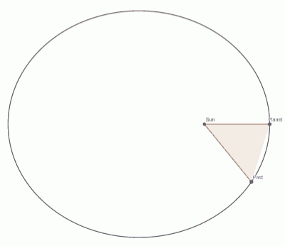

## Brief history

- Heliocentric worldview started with Aristarchus of Samos (&#8776; 300 BC)
- This was eventually refined by Nicolaus Copernicus (1543)
  - The sun is at the center of the universe and all planets rotate on circles around it.
- Refined by Johannes Kepler (1609-1621)
  - Planets are not on circles but on ellipses
  - Three laws of planetary motion
- A bit of interference by the Catholic Church
  - Galileo Galilei (1633)

---

## Kepler's three laws of planetary motion

1. The orbit of every planet is an ellipse with the Sun at one of the two foci
2. A line joining a planet and the Sun sweeps out equal areas during equal intervals of time.

3. The ratio of the square of a planet's orbital period with the cube of the semi-major axis of its orbit is the same for all planets
$$ T^2 \propto R^3 \quad \text{resp.} \quad \frac{T^2}{R^3} = \text{contant} $$

---

## Newton gravity

Isaac Newton develops laws of motion, concept of gravity and differential calculus (1665-1666; published 1687)
Force:
  $$ \vec{F} = m \vec{a} = m \frac{d^2 \vec{x}}{dt^2} $$
Gravity: Attractive force between two masses $m_1$ and $m_2$ at distance $r$
  $$ F = G \frac{m_1 m_2}{r^2} $$
... when one mass is much greater than the other that object can be considered stationary (Sun):
  $$ \frac{d^2 \vec{x}}{dt^2} = - \frac{\mu}{| \vec{x} |^2} \hat{x} \quad \mu = G M \quad \hat{x} = \frac{\vec{x}}{|\vec{x}|} $$
This can "almost" be solved analytically and confirms Kepler's laws.

---

## Additional insights of Newton mechanics

- Orbits always stay in a plane
- Sum of kinetic energy and potential energy is a constant
  $$ T + V = \text{const.} \quad T = \frac{1}{2}m \left| \frac{d\vec{x}}{dt} \right|^2 \quad V = - \frac{\mu}{|\vec{x}|} $$
- The angular momentum is also constant
  $$ \vec{x} \times \frac{d \vec{x}}{dt} = \text{const.} $$
- When you know the location and velocity at a specific time the orbit is uniquely defined.
- In addition to ellipses orbits can also be hyperbola and parabola (edge case)