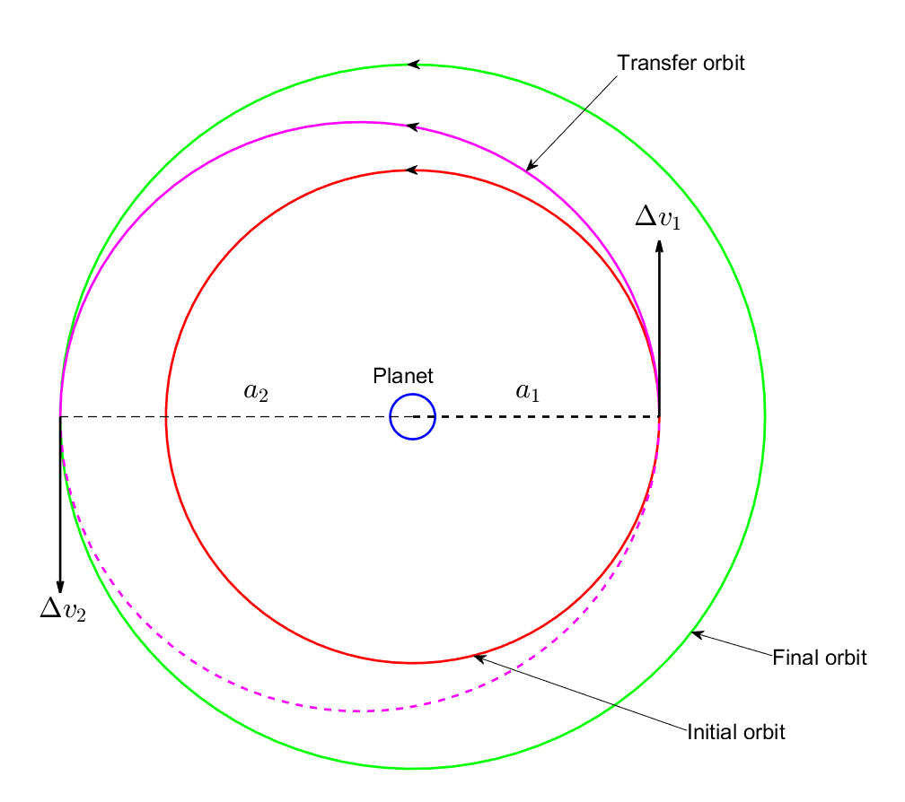
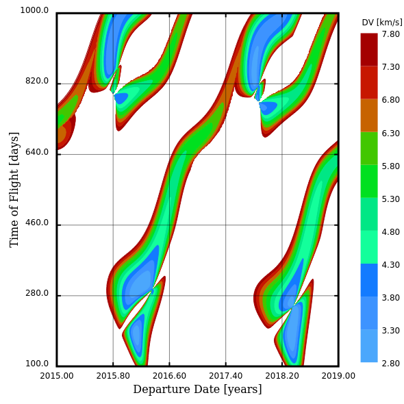

# How to get from A-to-B

Reaching a specific point is generally not that hard. But since everything is in motion it is necessary to reach a specific point at the correct time.
Example:
- Probe launches from earth orbit
- Has to move to mars orbit when mars is also at the same position.

---

## Hohmann transfer

- Orbits need to have (nearly) the same plane of motion
- Orbits have to be (nearly) circular

---

## Delta-V

---

## Lambert problem

---

