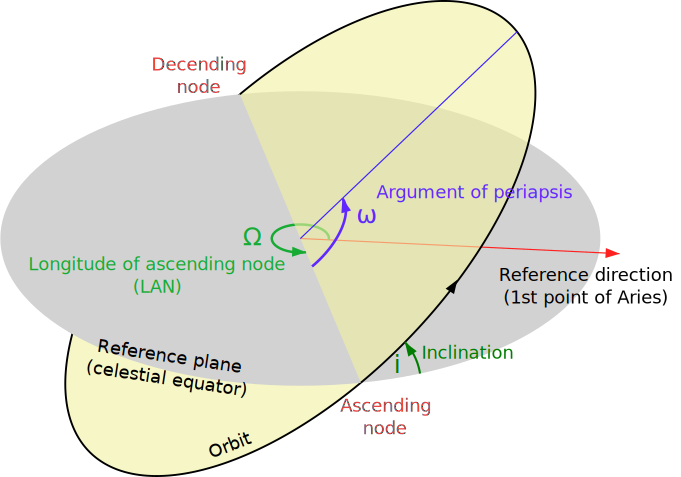
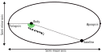
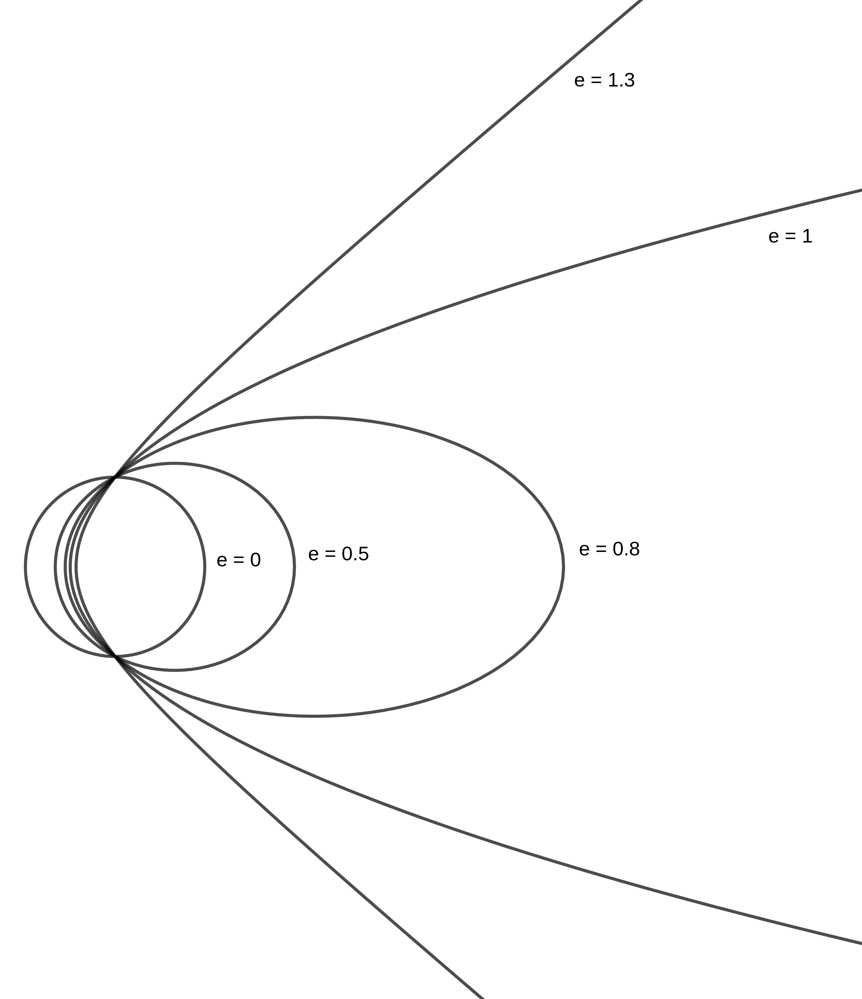

## Orbital elements

Define plane of motion in
3-dimensional space.
Requires a reference plane and a reference direction

Three angles:
- Longitude of ascending node
- Inclination
- Argument of periapsis

---

## Orbital elements (elliptic)

Eccentricity:
$$ e = \sqrt{1 - \frac{b^2}{a^2}} $$
$a$ semi major axis
$b$ semi minor axis

Radius of apoapsis, periapsis
$$r_p = a (1 - e) \quad r_a = a (1 + e) $$

---

## Orbit

In polar coordinates:
$$ r(\theta) = \frac{p}{1 + e \cos(\theta)} \quad p = a(1-e^2)$$

Circle (edge case): $e = 0$
Elliptic: $0 < e < 1$
Parabolic (edge case): $e = 1$
Hyperbolic: $e > 1$

(These are also cone-sections)

---

