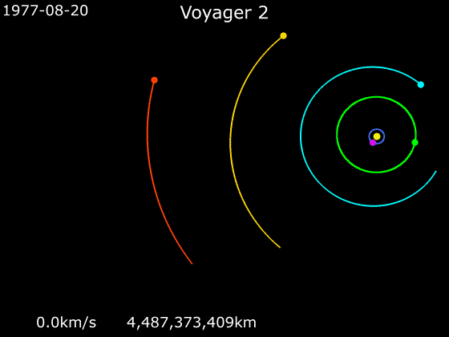

## Multi-body problem

- Kepler orbits only apply to two-bodies (usually one much heavier than the other)
- In a solar system there are usually many heavy objects that can affect the trajectory of a sattelite
- Usually a multi-body system can only be solved numerically
- Special case: Restricted three-body problem: Two heavy body rotating around their center of mass, one light satellite (Henri Poincare 1892-1899)

---

## Sphere's of influence

Use patched Kepler orbits by introducing spheres of influence (SOI) around each body.

As long as a satellite is in a SOI only the gravity of the associated body is considered.

$$ r_{SOI} \approx a \left( \frac {m} {M} \right)^{2/5}$$

$a$ semi major axis of smaller body
$m$ mass of smaller body
$M$ mass of larger body

---

## Swing-by (slingshot)

When satellite enters SOI it usually becomes a hyperbolic orbit inside that SOI.
Relative to Moon in and out velocity have same magnitude (conservation of angular momentum)

$$ \vec{r}'_{in} \times \vec{v}'_{in} = \vec{r}'_{out} \times \vec{v}'_{out}  $$

But as Moon is moving itself:

$$ \vec{v}_{in} = \vec{v}'_{in} + \vec{V}(t_{in}) $$
$$ \vec{v}_{out} = \vec{v}'_{out} + \vec{V}(t_{out}) $$

---

## Swing-by

A swing-by maneuver can be used to:

- Change direction of a satellite
- Accelerate of decelerate a satellite (dragging it along while inside the SOI)
- Usually course-correction burns are still necessary, but are way more efficient

---

## Example: Voyager 2

(Animation from wikipedia)

Earth, Jupiter, Saturn, Uranus, Neptun

---

## Example: Messenger

(Animation from wikipedia)

Mercury, Venus, Earth

